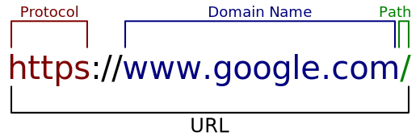

# HTML
Before we start learning to build websites, it would be beneficial to briefly explore (a simplified version of) what goes on 'under the hood' when you enter a URL into your browser's address bar. For the purposes of this example we will use one that should be familiar to most: the Google Homepage (https://www.google.com/).

## URL
URL stands for Uniform Resource Locator and serves as a unique address to allow browsers to find things on the web. You are probably most familiar with URLs in connection to webpages (such as the google homepage mentioned above), but anything that can be accessed on the web is a resource such as images, videos, pdfs etc, and all must have their own unique url.

A URL is divided into 3 main parts: the ***protocol***, which is the first part of the url up until the `://` (in this case https); the ***domain name***, which is the central portion of the url (in this case www.google.com); and finally the ***path***, which is the last part of the url from the forward slash onwards `/` (here only a single forward slash as we are accessing the website homepage). Your browser may hide the protocol (and path if it is the homepage) when a page is displayed in its address bar, but they are still there and will be visible if you copy and paste the url somewhere else.

<figure>
    
    <figcaption>
        Url breakdown of https://www.google.com/. Protocol = https, domain name = www.google.com, and path = /.
    </figcaption>
</figure>

### Protocols
The protocol is the method in which the browser accesses the resource, think of it a little like the various ways you could send a message to someone, such as writing a letter, calling them on the phone, or sending them a text message etc. For the purposes of building websites we don't need to understand how these work in-depth, just that most resources will generally be served over http or https.

### Domain names
The domain name is the unique identifier of the particular website we are visiting. If we were to think of resources as items stored in a warehouse, the domain name would be the address of the warehouse itself. Domain names are actually split up into smaller chunks, but we don't need to cover that for now.

### Paths
The path is the location of each individual resource. To reuse the analogy from earlier, if the domain name is the address to a warehouse, the path is the code for the slot on a shelf where the resource is stored. Just as a warehouse could not store multiple things in the exact same spot, neither can websites have multiple resources with the same path.

Each resource on the web must have a unique url in order to be found by browsers, but as the url is composed of the domain name *and* path, different websites may have resources with the same name.

## Requests and Responses
When you come to type a web address into your browser's address bar it must first make what is called a <abbr title="Domain Name System">DNS</abbr> lookup. This essentially involves consulting an online address book to find the ip address (a bit like a direct phone number) of the computer (known as the server) where the website domain is stored (hosted).

There are far too many websites out there for browsers to maintain their own address books of servers. Not only would they have to keep up to date with new ones being added, but also manage any changes of ip address where a website moves server. Instead, they first consult the DNS directory to find the current ip address of the website you are requesting.

Using this address the browser then makes a request to the server hosting the website for the page that you want to view.

All being well, the server should respond to this request by sending the page back as a .html file. This .html file contains the content of the page you wish to view and your browser uses this to render the page on your computer (displaying it on the screen for many users, but also reading it out for those who are blind or have a visual impairment).

To build websites, therefore, we need to create them in the format that browsers can understand: HTML.

## Hyper-Text Markup Language
HTML stands for Hyper-Text Markup Language. Hyper-Text is essentially techno-geek speak for documents that link to other documents. To return to the example of www.google.com, when you make a search on google it scans the web for pages that might match the words you are looking for, and presents them as a list of links sorted by what it feels are the most relevant. Selecting any of these links will take you to that page so you can continue your search. It would probably not be exaggerating things much to say that links between documents are the single thing that contributes the most to the usefulness of the internet.

To continue on with our breakdown of HTML you will notice that the L stands for language. In this case we are not referring to a language like English, Chinese, or Arabic, that is used by people to communicate with on another, but instead what is know as a computer language; which allows people to communicate with computers.

Fundamentally, computers deal in binary, familiar to most as longs string of 0s and 1s like this: 011001100. Having to use binary everytime we want to tell a computer to do something would obviously become very tedious and error prone, so very clever people have invented a whole series of languages which are closer to those you would use in everyday life and which we can use to write instructions that the computer will then convert to binary before it follows them. There are a whole host of different computer languages for different use cases, and HTML is the one we use for describing websites.

That, then, just leaves us with Markup. Markup describes the fact that HTML is a language for marking up documents; annotating parts of them to give them additional meaning. These annotations are what allow the browser to determine whether a particular part of the page is a piece of text or an image (along with a whole host of other possibilities) and serve as the instructions for how to build the page.

In the next chapter we will start to look at how html documents are formed.