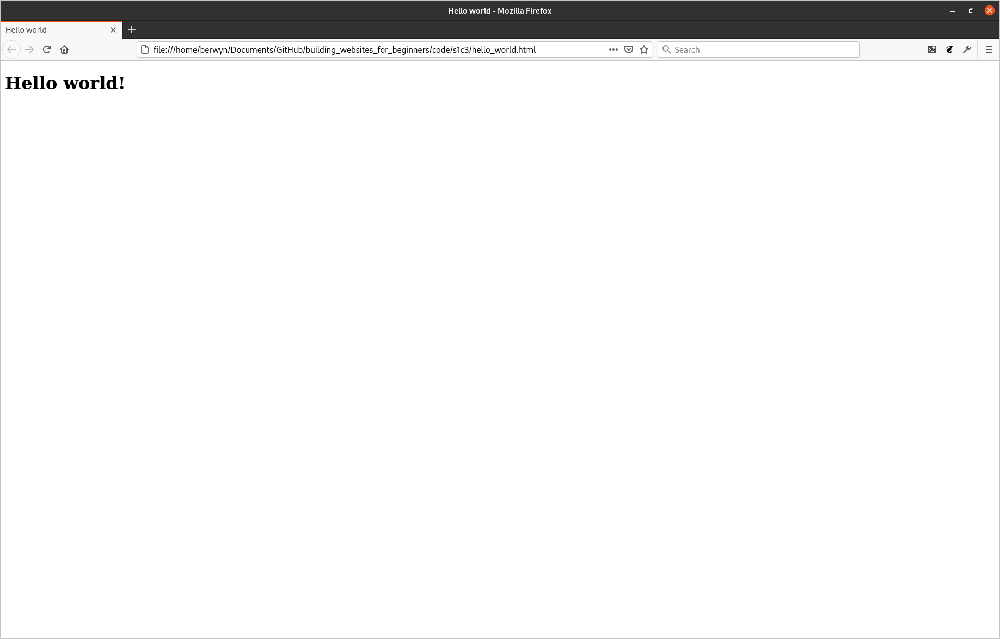

# Hello world
Now that you know what html tags and elements are we can look at our first webpage. There is an old tradition when learning any new computer language to first write something to display the sentence "Hello world!" to confirm everything is working correctly, and we are going to follow this.

To start with, please create a new file somewhere where you will keep your new webpages and call it `hello_world.html`, then open the file in a text editor and paste the following lines into it:
```
<!doctype html>

<html lang="en">

    <head>
        <meta charset="utf-8" />
        <title>Hello world</title>
    </head>

    <body>
        <h1>Hello world!</h1>
    </body>

</html>
```
If you then save the file and open it with a web browser you should see something like this:



There is a little bit more html here than I have shown you previously, but we will go over it line by line to explain what each element does.

The first element in the document is `<!doctype html>`, this is simply a marker to tell the web browser that the document is a html document. It also indicates that this document is formatted according to the HTML5 specification<sup id="a1">[1](#f1)</sup>, which is the current standard.

## Attributes

The next element is a bit more interesting as it introduces something we've not encountered before, have a look at just the html element, I've put an ellipsis character `…` in between the opening and closing tags to indicate that there is other content there that we are not currently interested in.
```
<html lang="en">
    …
</html>
```
You will notice that there is some other text in the opening tag, after the tag type, but before the closing angle bracket. This is what is called an attribute. Attributes give additional meaning to elements than their type alone confers. In the case of the html element, it has a language attribute indicating that the content of the webpage is written in the English language. Other possibilities include `fr` for French and `ar` for Arabic<sup id="a2">[2](#f2)</sup>.

Attributes consist of the name of the attribute (what type it is), an `=` sign and the value of the attribute (almost always enclosed in quotation marks `""`). Elements can have any number of attributes and they are separated from one another (and the tag name) by a space.

The other thing to note is that, as the `html` element wraps everything else in the document, it is the ancestor for every element on the page. It is often referred to as the 'root' element as, like the roots of a tree, all the branches are descended from it.

The `html` element always has two children, `head` and `body`. As you may be able to deduce from comparing the code for the webpage with what is displayed when viewing it in a browser, the `body` element contains all the actual content for the page; any elements that you add as descendants of the `body` will be rendered by the browser when someone views the page. The two elements which are inside the `head` tags don't seem to be being displayed, so what is their purpose? The answer to that is that they are proving 'metadata' about the page.

## Metadata

To quote wikipedia: "Metadata is data that provides information about other data". That may sound opaque and possibly a little intimidating, but the concept is actually quite simple. If we were to for a moment pretend that our website was actually a piece of music on our computer, the body of the page would be the song itself and the head would be all the information about the song; such as its Title, the Artist, Composer, Album it is from, and Year in which is was recorded. None of this 'metadata' forms part of the song itself, but it provides us with a lot of additional information about it. Similarly, if you were to view a photograph on your computer, it might also have some metadata attached to it proving information about when the photograph was taken, what camera and lens were used to take it, and what the exposure settings were.

The elements in a html document's `head` are no different, and provide information to the browser and user about the page. In the case of our example above, there are only two elements in the head, but there can be many more. The first element is a `meta` element, with the `charset` attribute. All text on a computer is stored using a particular "character set" which tells the computer how to convert the binary 1s and 0s into letters, a little like morse code allows transferring messages using only dots and dashes. The `charset` attribute tells the browser that the text on the page is encoded using the `utf-8` character set, which is generally the one used on the web.

## Empty elements

You may notice that there is something unusual about the `meta` element that we have not encountered before; it is missing a corresponding end tag. The vast majority of html tags are used to provide meaning to pieces of content, such as the `h3` and `p` elements we have seen previously. `meta` elements, however, do not wrap any content, and exist purely as containers for attributes. To save you having to type out both opening and closing tags for elements like these, and to avoid them being given any child elements which would be considered invalid, HTML requires you to skip the closing tag entirely.

There are a few of these empty elements and we will encounter some of the others later. While HTML5 allows you to type out the element as if it was just an opening tag (e.g. `<meta charset="utf-8">`), previous versions of the specification required you to explicitly mark them out as self-closing by adding a forward slash `/` before the closing angle bracket, and it is a good idea to do this so you can tell at a glance which elements are empty. Throughout this book I will use the convention of adding a forward slash to all self-closing tags.

The only other element in the head is a `title` element with the content "Hello world". As the name suggests, the title element tells the browser what the page's title is, and is used on browser tabs and and when the page appears in search results. Try changing this and refreshing the page, the title of the open tab should change to whatever new text you have entered.

## Body content

The other child of the `html` element is the `body` element and, as alluded to above, includes the actual content of the page. For now we just have a `h1` element with the content "Hello World!". Try changing this text, or adding in some of the elements we covered in the last section and refreshing the page in the browser to see how adding elements to the body changes what the browser displays; make sure you remember to save the text document though, otherwise the changes you make will not be rendered. 

### Footnotes
<ol class="footnotes">
<li id="f1">HTML has gone through several major revisions in its history, each one adding (and occasionally removing) features.</li>
<li id="f2">The lang attribute can also be added to other elements on the page where you have text in multiple languages. Where this is the case, try and set the html lang attribute to the one used for the majority of the page and use lang on other elements where they differ from the main content. For a list of all the languages that the attribute have a look at the <a href="https://www.w3schools.com/tags/ref_language_codes.asp">HTML Language Code Reference</a> on w3schools..</li>
</ol>

---
<a rel="license" href="http://creativecommons.org/licenses/by-nc-sa/4.0/"></a><br />This work is licensed under a <a rel="license" href="http://creativecommons.org/licenses/by-nc-sa/4.0/">Creative Commons Attribution-NonCommercial-ShareAlike 4.0 International License</a>.