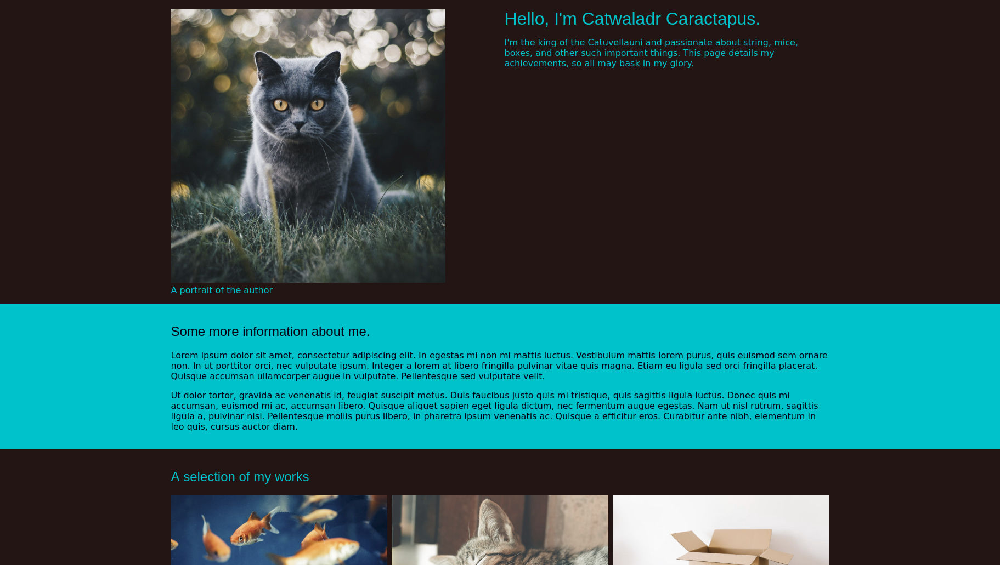
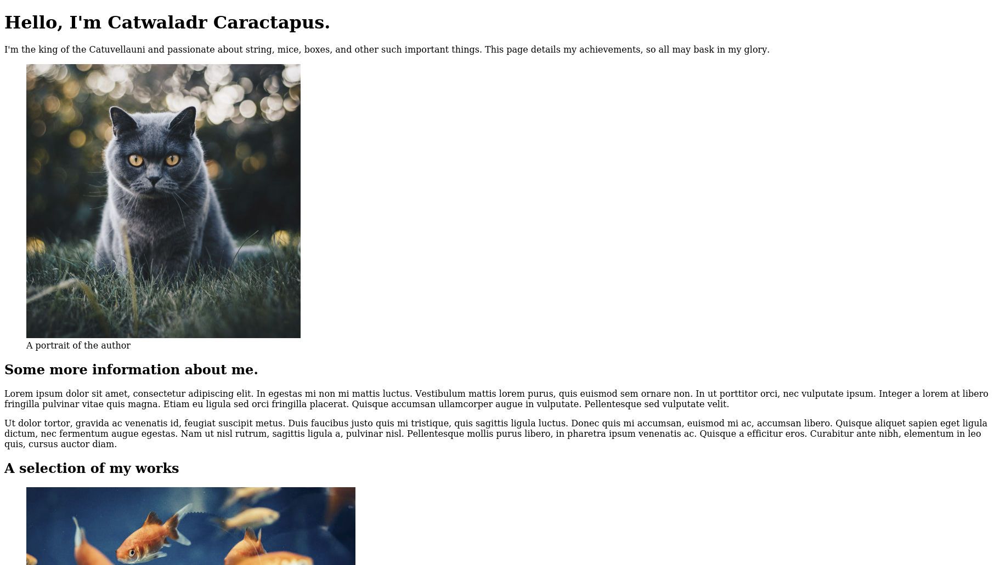

# Starting the first website

Now that we have seen how html documents are structured we can start building our first webpage. For the rest of this section we will expand upon our knowledge of HTML by building a simple portfolio page, adding sections to it as we learn about some of the different types of elements that are available to use. Then, in the next section on CSS, we will add some styling to make the page more visually interesting. By the end of the CSS section we should have a completed webpage that looks a bit like this:

## Content. Styling. Interactivity.

You may remember that in the introduction I talked about the web being made up of three main languages (HTML, CSS & JS) and that, while we have only just started learning about HTML, I have already started talking about CSS. Panic ye not, there is a reason for this.

Back in the early days of the web all pages were built entirely in HTML, which has very little scope for modifying the appearance of individual elements. If someone wanted to change the way a particular part of the page looked, therefore, they would often have to change which elements they were using. A common example of this is trying to make headings look smaller by replacing all `h1` tags with `h2` tags, or even, `h3`[1](#f1). This comes with some major downsides.

Humans are very good at inferring contextual information from the visual relationships between objects. Machines (and those humans who can not see), however, are not and the content of a page where any text that you wanted to make bigger had been wrapped in heading tags would read very differently to them. As a result, any page built with elements selected for visual appearance rather than meaning can be very difficult for screen reader users to understand, and would likely appear incorrectly when being indexed by a search engine, or in any other system where a machine first processes the page.

To overcome this difficulty, webpages are now built using more than one language. HTML is used purely to describe the content of the page, while CSS controls the appearance and JS any additional interactive elements that are needed. By having a separation of concerns between the different languages like this, we can ensure that our websites will work in the widest possible context; there is no point making a beautiful website if no one can find it using a search engine and when they do stumble upon it by accident they can not use it if they have any disabilities.

HTML also comes with a lot of functionality already implemented by browsers that, if you use the wrong element for the job, you either have to recreate yourself, or lose altogether. Despite the advantages of using HTML purely to describe the content of a page, many people still try and use it to handle appearance and layout as well. Please don't fall into this trap as it will make life a lot more difficult for both you and your users.

I mention all of this because firstly it is important[2](#f2), and secondly because after the end of the section on HTML our first website will actually look rather more like this:

Please don't let this put you off. It might not look like much, but it will be the solid foundations from which you can build an amazing website. Before you know it you will have also got the hang of CSS and will be building useful *and* beautiful websites.

That's enough talking from me, let's get our hands dirty with some more HTML.

### Footnotes
<ol class="footnotes">
<li id="f1">Though there are many others such as turning links into buttons, or even using images for text.</li>
<li id="f2">I really do apologise for going on so much about this topic. Rants like this will be kept to an absolute minimum I promise.</li>
</ol>