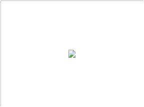
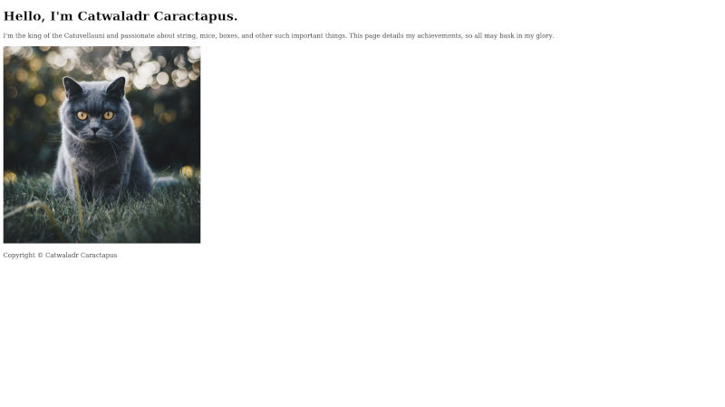

# Basic page structure

In this chapter we're going to begin work on the initial html structure of our first website. The core purpose of any html document<sup id="a1">[1](#f1)</sup> is to convey information; whether that is the particulars of a breaking news story, the recipe to cook a certain dish, or even the various prices and specifications of different products that visitors might like to purchase. If you look at a selection of different pages from across the web, however, you may notice that they frequently contain a lot more than just this core content. This very often takes the form of elements which are shared across the site, such as a header with navigation and the site logo, or a footer with copyright information, but can also be supporting information more specific to the page, such as a sidebar with a list of related posts.

As all of this ancillary information is separate from the main page content, we want to contain it in different elements in order to differentiate it. First things first, though, we need to create our new project. Typing out the required elements of a page every time you start a new project can become quite tedious and error prone, fortunately, we already created a minimal page that we can use as a starting point in Chapter 3. Copy `hello_world.html` into a new folder that will contain all the files for our current project<sup id="a2">[2](#f2)</sup> and rename it to `index.html`.

## Website file structure
The reason that we are renaming the file is that, when you come to actually upload your website to the web, the server that hosts it will need to locate which file it should serve to visitors when they request a particular page. The convention is generally to have each page in its own folder, with the structure of the folders mirroring that of the pages on the website<sup id="a3">[3](#f3)</sup>. When the server comes to look in the appropriate folder for a particular page, it will first look for a file called `index.html`, so we're just making its job as easy as possible.

Once you have copied and renamed the file, the next step is to open it in a text editor and remove the `<h1>` element from the `<body>`, so that it looks something like this.
```
<!doctype html>

<html lang="en">

<head>
    <meta charset="utf-8">

    <title>My website</title>
</head>

<body>
</body>

</html>
```

This is about the minimum information a browser needs to properly load and render a page and we will expand upon this by adding all of the content for the page into the empty `body`.

## \<header>

The first thing we are going to add to the page is a `header` element. Add the following lines<sup id="a4">[4](#f4)</sup> right after the end of the opening `body` tag:
```
<header>
    <h1>Hello, I'm Catwaladr Caractapus.</h1>
    <p>
        I'm the king of the Catuvellauni and passionate about string, mice, boxes, and other such important
        things. This page details my achievements, so all may bask in my glory.
    </p>
    
</header>
```
The `header` element serves as a container for introductory content about the page, such as the page's title, date it was created, the author, brand image etc. In this case we have added the page title as a `h1` and a short introductory paragraph contained in the `p` element. As mentioned above, the header does not represent the main content of the page, but rather supporting information that tells us more about it. In some respects, it is a little like the `head` element we encountered earlier, but with the important distinction that, because it is a descendent element of the `body`, anything contained within it will be displayed to the user.

## Replaced elements

The last child of the header is a new type of element we have not seen before, an `img`. Img stands for image, and is the tag used to add images to a page. It is also one of a handful of special tags referred to as 'replaced elements'.

Because HTML files are text files, and most image formats are stored as binary, we can not embed them directly into web pages. Instead, we must use an `img` element with a `src` attribute that contains the location of the image we want to embed into the page. When the browser comes to process the html file it sees the `img` tag and looks for an actual image in the location pointed at by the `src` attribute. If it finds an image it then displays it at the same location as the `img` element. Video and audio clips also have to be embedded into pages in a similar way (using a `video` and `audio` element respectively) for the same reason.

When browsing the web you may have occasionally seen a strange little icon like this where instead you expected to seen an image:



As the image referenced to by an `img` tag is stored separately, there is no guarantee that the browser will be able to load it and, rarely, you will instead get this icon; either because the referenced image has moved, or the connection to download it was interrupted.

## Paths
The `src` attribute on our `img` is pointing to `./images/pexels-kirsten-bühne-1521304.jpg`. If you are using Mac or Linux this probably looks very familiar to you, but Windows users might be wondering why the slashes are facing forwards (`/`) instead of backwards (`\`), so we will take a few moments to explore how paths work on the web.

The web uses Unix<sup id="a5">[5](#f5)</sup> style paths. In this system, directory levels are seperated by a forwards slash `/`. The `./` at the start of the path denotes it is a *relative* path, one that starts from wherever the current file is. Paths can also be *absolute* (starting with a forward slash `/`), which means that they start from the `root`, in the case of a website this is usually the location of the homepage's `index.html`.

Using this slightly simplified model of how paths work we can deduce that the server will be looking for a file called `pexels-kirsten-bühne-1521304.jpg` in the `images` folder that resides in the same location as the `index.html` file that is referencing it. If this is a little over your head at this point, don't worry, you'll soon get the hang of it. All you need to remember is that the webpages you will be creating are all .html files that need to reference other files on the server, so the paths you enter into any `src` attributes need to reflect this.

## Alt tags

The other attribute on our `img` element is an `alt` attribute, often erroneously referred to as an alt tag. As images are a purely visual medium, they can not convey any meaning to visitors using a screen reader, and the `alt` attribute contains a text alternative to the image that will be read out instead. This text will also be displayed alongside the above icon in situations where the image fails to load.

While the alt attribute is not required, you should always include one with your images to help visitors with a disability better understand the content of the page. In cases where an image is purely decorative, and reading out a text alternative might be confusing, you can leave the alt attribute empty like so `alt=""`; most screen readers will read out the entire image url in cases where there is no alt attribute present, which would be even more confusing, by leaving it empty the screen reader will instead remain silent when it reaches the `img` element.

## \<footer>

We are also going to add a simple footer to our page containing copyright information. Copy and paste the following lines right before the closing `</body>` tag:
```
<footer>
    <p>Copyright &copy; Catwaladr Caractapus</p>
</footer>
```
The `footer`, just like the `header`, contains supporting information not directly related to the main page content. Here we are just adding copyright information, but contact details and further navigation links are also common.

## HTML Entities

The funny looking `&copy;` is what is known as a html entity. In HTML, certain characters are reserved by the language and, if typed, will instead be interpreted as part of an element (for example the opening and closing angle brackets `<>`). If we want to actually use these in text we must instead type in the corresponding entity, which will be interpreted by the browser and displayed as if it were the correct character.

They all follow the format of starting win an ampersand `&`, having a type, and ending with a semi-colon `;`. There are also entities for characters that don't generally appear on a keyboard, and `&copy;` is converted by the browser into the copyright symbol &copy;. For a complete list of all available html entities have a look at the [official specification](https://html.spec.whatwg.org/multipage/named-characters.html#named-character-references).

## Wrapping up

With the `footer` added we now have all the supplementary information that we will use for the page complete. We've covered a lot of ground in this chapter, so don't worry if all of it didn't stick the first time around and you have to read through some of it again. If all has gone well your first webpage should now have a similar structure to the code snippet below:
```
<!doctype html>

<html lang="en">

<head>
    <meta charset="utf-8">

    <title>My website</title>
</head>

<body>
    <header>
        <h1>Hello, I'm Catwaladr Caractapus.</h1>
        <p>
            I'm the king of the Catuvellauni and passionate about string, mice, boxes, and other such important
            things. This page details my achievements, so all may bask in my glory.
        </p>
        
    </header>
    <footer>
        <p>Copyright &copy; Catwaladr Caractapus</p>
    </footer>
</body>

</html>
```
and look something a little like this when viewed in a web browser (though obviously with different content if you are using your own):



In the next chapter we will start work on the main page content.

### Footnotes
<ol>
    <li id="f1">In HTML terminology a page is referred to as a document.</li>
    <li id="f2">Mine is called website_1_final, but you probably want to name it something a bit more friendly such as 'My Portfolio' for something similar.</li>
    <li id="f3">e.g. the homepage of a website called example.com would be a file called index.html in a folder named example.com. The contact page would also be called index.html, but would be located in a sub-folder of example.com named contact.</li>
    <li id="f4">I will be using dummy content for this project just to show you how the website would look were you to make a similar site for yourself. Please do replace the text and images here with something appropriate to yourself, that way your first ever website might have some additional utility beyond being merely a learning aid.</li>
    <li id="f5">Unix is a family of computer operating systems with their roots dating back to the 1970s. Both MacOS and Linux are Unix-like operating systems, and thus share the same path format. Windows, as usual, does things a little differently and you can <a href="https://www.howtogeek.com/181774/why-windows-uses-backslashes-and-everything-else-uses-forward-slashes/">read more about why windows uses backslashes</a> on how-to geek if you are interested.</li>
</ol>