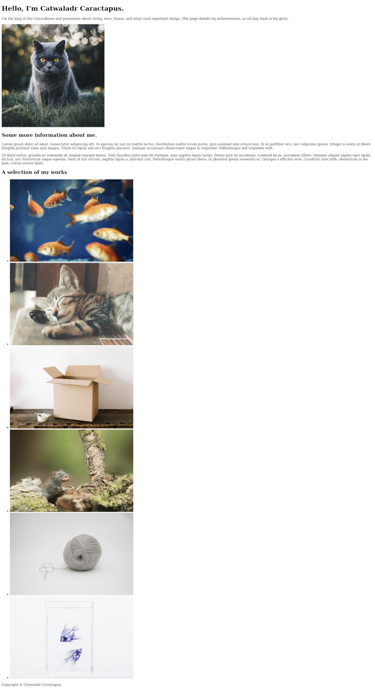

# Sections
In this chapter we're going to start building the primary content of the page. If you look at a [screenshot of the completed page](images/s1c6/Full_page.jpg), you should see it is split into different sections: there are a couple of paragraphs of biography, a gallery, a table describing the details of past employments and a contact form. Each of these sections contains distinct information, and we will separate them out in the document to convey this.

To start with, open up the `index.html` file you have from the end of the last chapter and add the following lines between the end of the `header` and start of the `footer` elements. Here the ellipsis `…` characters are denoting that you should only copy the content between them. Anything before the first and after the last is simply to show where the new lines should be added into the document.
```
</header>
…
<main>
    <section>
        <h2>Some more information about me.</h2>
        <p>
            Lorem ipsum dolor sit amet, consectetur adipiscing elit. In egestas mi non mi mattis luctus. Vestibulum
            mattis lorem purus, quis euismod sem ornare non. In ut porttitor orci, nec vulputate ipsum. Integer a
            lorem
            at libero fringilla pulvinar vitae quis magna. Etiam eu ligula sed orci fringilla placerat. Quisque
            accumsan
            ullamcorper augue in vulputate. Pellentesque sed vulputate velit.
        </p>
        <p>
            Ut dolor tortor, gravida ac venenatis id, feugiat suscipit metus. Duis faucibus justo quis mi tristique,
            quis sagittis ligula luctus. Donec quis mi accumsan, euismod mi ac, accumsan libero. Quisque aliquet
            sapien
            eget ligula dictum, nec fermentum augue egestas. Nam ut nisl rutrum, sagittis ligula a, pulvinar nisl.
            Pellentesque mollis purus libero, in pharetra ipsum venenatis ac. Quisque a efficitur eros. Curabitur
            ante
            nibh, elementum in leo quis, cursus auctor diam.
        </p>
    </section>
</main>
…
<footer>
```

## \<main> and \<section>
The first new element we have added here is a `main` element as a sibling to the `header` and `footer`. Just as the `footer` and `header` elements represent the footer and header of a document, so too does the `main` element serve as a container for the page's primary, or dominant, content. You should only have a single `main` element per page, and all of the document's primary content should be a descendant of it.

The child of our new `main` element is a `section` element. The `section` element is used to group related content that does not necessarily have a more specific element available, such as the headers and footers we have already seen, and it should have a heading element as a child to describe what the content of the section is.

The [Mozilla Developer Network](https://developer.mozilla.org/en-US/docs/Web/HTML/Element/section) suggests that you should use a `section` where "a section should logically appear in the outline of a document"; for example, if we were creating a page detailing the recipe for a particular meal, we might choose to contain all of the ingredients in one section, and the steps to cook the meal in another. Here, of course, we have used it as a container for the biographical paragraphs.

As the word *suggests* in the proceeding paragraph implies, there are very few strict rules for building web pages, and it often comes down to using whichever element seems most appropriate. The best guide is to be as specific as possible without altering the meaning of your content (e.g. don't wrap content in a heading just because you can, but if it actually is a heading always mark it as such), as this makes it easy for people and machines to understand it. In the case of `section`s, the suggestion to think of a document outline is a very good one; think about how you would try and find the information you need if you were speed-reading the page. If someone was only interested in getting in touch with us, they might not wish to read through the rest of the page first. Wrapping related elements together in sections like this helps visitors to find the part of the document they are interested in.

## A Gallery
The next thing we are going to add to the page is a gallery showcasing some of the author's work, and we will make this another section. Copy and past the following line after the end of the previous `section`, and before the end of the `main`:
```
    </section>
…
    <section>
        <h2>A selection of my works</h2>
        <ul>
            <li>
                
            </li>
            <li>
                
            </li>
            <li>
                
            </li>
            <li>
                
            </li>
            <li>
                
            </li>
            <li>
                
            </li>
        </ul>
    </section>
…
</main>
```
The first child of the new `section` is a `h2` describing what the section contains. The `img`, `ul` and `li` elements we have already seen before, they are just being combined here in a new way. There are several ways you could represent an image gallery in HTML, but I like to use a list as I feel that makes the most sense semantically; we are listing out some of the author's work, and those pieces happen to be represented as images.

## Wrapping up
After adding the image gallery, your page code should resemble this:
```
<!doctype html>

<html lang="en">

<head>
    <meta charset="utf-8">

    <title>My website</title>
</head>

<body>
    <header>
        <h1>Hello, I'm Catwaladr Caractapus.</h1>
        <p>
            I'm the king of the Catuvellauni and passionate about string, mice, boxes, and other such important
            things. This page details my achievements, so all may bask in my glory.
        </p>
        
    </header>
    <main>
        <section>
            <h2>Some more information about me.</h2>
            <p>
                Lorem ipsum dolor sit amet, consectetur adipiscing elit. In egestas mi non mi mattis luctus. Vestibulum
                mattis lorem purus, quis euismod sem ornare non. In ut porttitor orci, nec vulputate ipsum. Integer a
                lorem
                at libero fringilla pulvinar vitae quis magna. Etiam eu ligula sed orci fringilla placerat. Quisque
                accumsan
                ullamcorper augue in vulputate. Pellentesque sed vulputate velit.
            </p>
            <p>
                Ut dolor tortor, gravida ac venenatis id, feugiat suscipit metus. Duis faucibus justo quis mi tristique,
                quis sagittis ligula luctus. Donec quis mi accumsan, euismod mi ac, accumsan libero. Quisque aliquet
                sapien
                eget ligula dictum, nec fermentum augue egestas. Nam ut nisl rutrum, sagittis ligula a, pulvinar nisl.
                Pellentesque mollis purus libero, in pharetra ipsum venenatis ac. Quisque a efficitur eros. Curabitur
                ante
                nibh, elementum in leo quis, cursus auctor diam.
            </p>
        </section>
        <section>
            <h2>A selection of my works</h2>
            <ul>
                <li>
                    
                </li>
                <li>
                    
                </li>
                <li>
                    
                </li>
                <li>
                    
                </li>
                <li>
                    
                </li>
                <li>
                    
                </li>
            </ul>
        </section>
    </main>
    <footer>
        <p>Copyright &copy; Catwaladr Caractapus</p>
    </footer>
</body>

</html>
``` 
and look something a little like this when viewed in a web browser (though obviously with different content if you are using your own):


If your page doesn't look right, or you think you've made a mistake somewhere, don't worry! As the examples get more complex, it will get increasingly easy to miss out a line when copying, or to accidentally paste it into the wrong place. Take a few minutes and see whether you can figure out what's gone wrong yourself and fix it. If you can't, or would just like to check against my own version you can find the original files I worked from in the [book's source code](https://github.com/BezPowell/building_websites_for_beginners/blob/master/code/s1c6/index.html). There are also files for all the other chapters there as well if you would like to study them. It's also possible I have made a mistake with one of the examples; if you do spot this please let me know at [bez@pinopticon.net](mailto:bez@pinopticon.net) so I can fix it.

In the next chapter we will add the cv table which will introduce us to a few more html elements.  